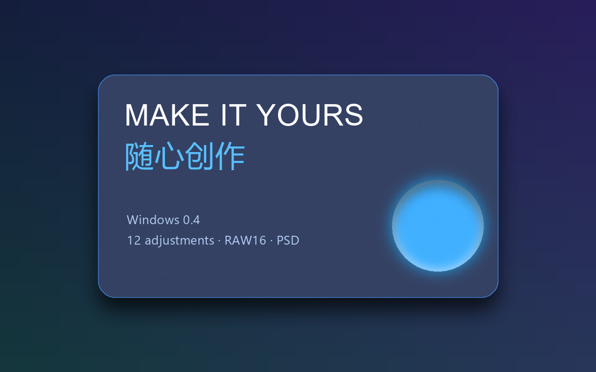

# Compositor Windows

免费的 Windows 图层图像编辑器，参考 [Compositor v1.4.6](https://github.com/robbietilton/Compositor/tree/v1.4.6) 的 MIT 源码与工程格式独立移植。此项目为预览版，与 Apple、Adobe 及上游作者无官方关联。



从 [Releases](https://github.com/swimming001/Compositor-Windows/releases/latest) 下载便携 ZIP，解压整个文件夹后运行 `Compositor-Windows.exe`。无需 Python，离线 AI 模型随包提供；请保留 `_internal` 和许可证文件。当前发行包面向 Windows x64。

详细操作见 [中文使用说明](README-中文.md)，问题修复与验证见 [0.4 更新与验收](0.4-更新与验收.md)。

当前版本 **0.4.1** 修复保存目录和权限失败后的恢复流程，见 [保存修复说明](0.4.1-保存修复说明.md)。

## 功能

- 图层、组、蒙版、剪贴、16 种混合与撤销；移动、缩放、旋转、绘制、擦除和裁剪。
- GPU 混合合成、后台预览及原像素分块；后台导入、保存、导出、像素滤镜。
- 离线 U²-Net 主体分割，DirectML 加速与 CPU 回退。
- LibRaw 显影导入，以及直接从 RAW 导出真实 16 位 sRGB TIFF。
- 原版全部 12 种调整层，四通道色阶/曲线，六种图层效果。
- 多行文字、局部字体/颜色、字距、行距、对齐、文本框与换行。
- `.comp` 工程，PNG/JPEG 输出，PSD 分层与兼容导出，八种原生 PSD 调整层。

工作空间为 8 位 RGBA；RAW16 导出直接读取原始文件。部分 Photoshop 功能需栅格化、提示差异或拒绝转换，尚未在 Adobe 中实测往返。GPU 用于混合合成，部分滤镜和采样使用 CPU。完整兼容范围见中文说明。

## 源码运行

建议 Windows x64、Python 3.12，在仓库目录执行：

```powershell
py -3.12 -m venv .venv
.venv\Scripts\python.exe -m pip install -r requirements.txt
.venv\Scripts\python.exe fetch_v03_assets.py --models-only
.venv\Scripts\python.exe app.py
```

初次安装和获取模型需联网，便携发行包可离线运行，运行时照片留在本机。下载脚本内含模型地址与官方校验。

## 测试和构建

```powershell
.venv\Scripts\python.exe fetch_v03_assets.py
.venv\Scripts\python.exe -m unittest -v test_engine test_app test_v02 test_v03 test_v04 test_save *> verification/v0.4.1-tests.txt
.venv\Scripts\python.exe app.py --verify-v04 verification/v0.4.1-source --assets verification/v0.3-fixtures
.venv\Scripts\python.exe build.py
```

下载脚本另取上游测试照片/RAW/PSD，并生成自制分组样本；这些测试素材不随发行包发布。打包后分别检查 EXE 的 GPU/CPU 路径，再执行 `python finalize_v04.py` 生成最终 ZIP 和 SHA-256。具体命令见中文说明。

## 许可证

代码为 [MIT](LICENSE)，保留上游版权。模型及运行库来源见 [NOTICE.md](NOTICE.md)、`models/` 及发行包内 `licenses/`。模型权重置于 Release 下载包，不纳入 Git 历史。
